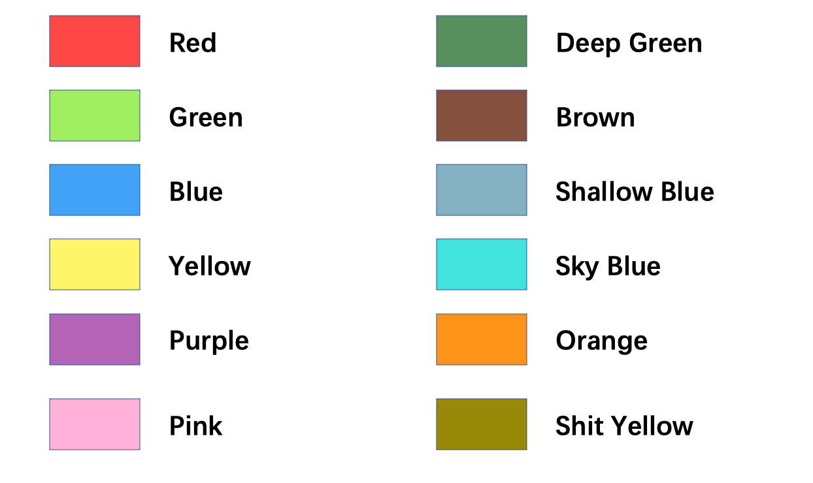
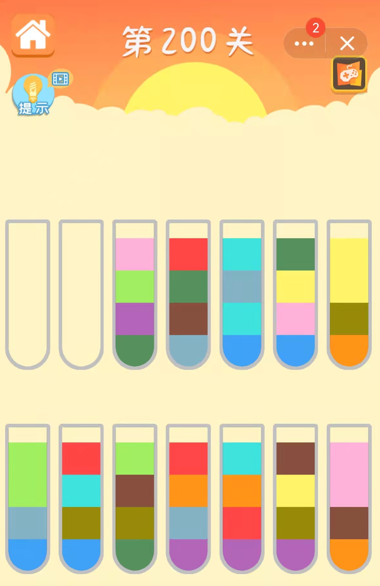
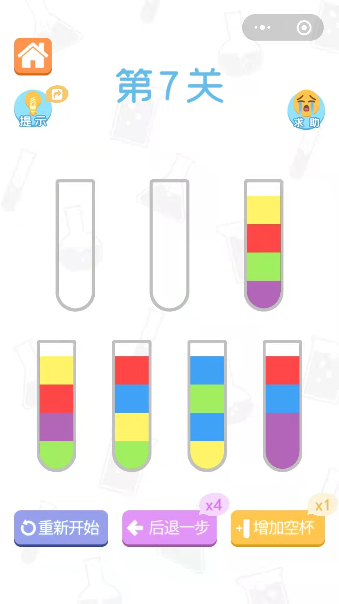
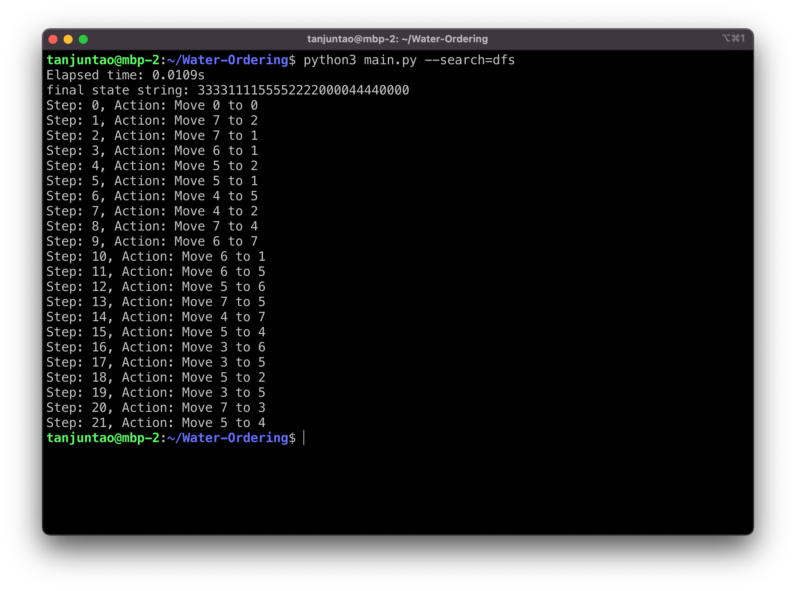
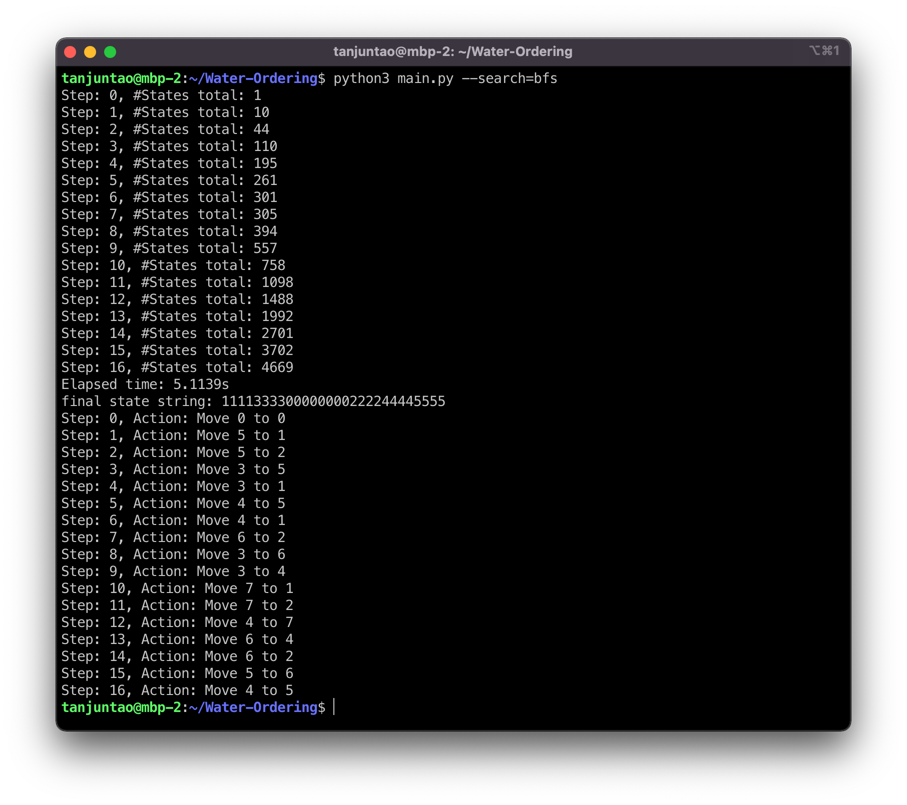

# Water Sort Puzzle Solutions

## 1. Game introduction

Water sort puzzle is a very interesting game, you can find it by searching for the keyword "水排序" in the WeChat MiniProgram or QQ MiniProgram.

The rules of the game are: each time you can only pure water of the same color from one bottle, and then pure it into another bottle, which requiring that the color of the top of another bottle should be the same as the color of the poured water. Finally, when all bottles contain only one color each, you are done!

## 2. Repo introduction

The structure of this repo is:

```
├── README.md
├── board.py
├── bottle.py
├── color.py
├── input.py
└── main.py
```

The function of each python file is:

* `color.py`: mapping from colors to integers and characters;
* `input.py`: program input;
* `bottle.py`: each bottle of the game;
* `board.py`: all bottles are treated as a board;
* `main.py`: main program；

## 3. Usage

### 3.1 Color mapping



All colors are definied in `colors.py`.

### 3.2 Prepare input

Depending on the current game level, you should modify the `get_start_bard()` function in `input.py`. 

Taking level 200 as an example.



You should change `bottles` in `get_start_board()` function like this:

``` python
N_BOTTLES = 14
bottles[0] = [Colors.BLANK, Colors.BLANK, Colors.BLANK, Colors.BLANK]
bottles[1] = [Colors.BLANK, Colors.BLANK, Colors.BLANK, Colors.BLANK]
bottles[2] = [Colors.DEEP_GREEN, Colors.PURPLE, Colors.GREEN, Colors.PINK]
bottles[3] = [Colors.SHALLOW_BLUE, Colors.BROWN, Colors.DEEP_GREEN, Colors.RED]
bottles[4] = [Colors.BLUE, Colors.SKY_BLUE, Colors.SHALLOW_BLUE, Colors.SKY_BLUE]
bottles[5] = [Colors.BLUE, Colors.PINK, Colors.YELLOW, Colors.DEEP_GREEN]
bottles[6] = [Colors.ORANGE, Colors.SHIT_YELLOW, Colors.YELLOW, Colors.YELLOW]
bottles[7] = [Colors.BLUE, Colors.SHALLOW_BLUE, Colors.GREEN, Colors.GREEN]
bottles[8] = [Colors.BLUE, Colors.SHIT_YELLOW, Colors.SKY_BLUE, Colors.RED]
bottles[9] = [Colors.DEEP_GREEN, Colors.SHIT_YELLOW, Colors.BROWN, Colors.GREEN]
bottles[10] = [Colors.PURPLE, Colors.SHALLOW_BLUE, Colors.ORANGE, Colors.RED]
bottles[11] = [Colors.PURPLE, Colors.RED, Colors.ORANGE, Colors.SKY_BLUE]
bottles[12] = [Colors.PURPLE, Colors.SHIT_YELLOW, Colors.YELLOW, Colors.BROWN]
bottles[13] = [Colors.ORANGE, Colors.BROWN, Colors.PINK, Colors.PINK]
```

`N_BOTTLES` is the total number of bottles, in our case, 14. YOU SHOULD MODIFY THIS VARIABLE IF YOU ARE PLAYING ANOTHER GAME LEVEL.

`bottles` is a two-dimension Python list, each element of it is a bottle, which is also a Python list. 

ALL YOU SHOULD REMEMBER IS THAT: the colors in each bottle need to be entered in order from bottom to top. For example, `bottles[2]` should be 

``` python
bottles[2] = [Colors.DEEP_GREEN, Colors.PURPLE, Colors.GREEN, Colors.PINK]
```

rather than

``` python
bottles[2] = [Colors.PINK, Colors.GREEN, Colors.PURPLE, Colors.DEEP_GREEN]
```

b.t.w: Empty bottle is composed of `Colors.BLANK`.

### 3.3. Run 

1. (Default) Use DFS (Depth First Search)

``` shell
$ python3 main.py --search=dfs
```

2. Use BFS (Breadth First Search)

``` shell
$ python3 main.py --search=bfs
```

## 4. Example

Taking level 7 as an example. 



First, we modify `get_start_board()` function so it look likes this:

``` python
N_BOTTLES = 7 
bottles[0] = [Colors.BLANK, Colors.BLANK, Colors.BLANK, Colors.BLANK]
bottles[1] = [Colors.BLANK, Colors.BLANK, Colors.BLANK, Colors.BLANK]
bottles[2] = [Colors.PURPLE, Colors.GREEN, Colors.RED, Colors.YELLOW]
bottles[3] = [Colors.GREEN, Colors.PURPLE, Colors.RED, Colors.YELLOW]
bottles[4] = [Colors.GREEN, Colors.YELLOW, Colors.BLUE, Colors.RED]
bottles[5] = [Colors.YELLOW, Colors.BLUE, Colors.GREEN, Colors.BLUE]
bottles[6] = [Colors.PURPLE, Colors.PURPLE, Colors.BLUE, Colors.RED]
```

Second, we run our DFS and BFS searching algorithm respectively:

* DFS



* BFS 



We can see that BFS takes fewer steps than DFS, because BFS guarantee that the solution is optimal in an unweighted graph. But BFS will take more searching time. When the number of bottles is small, this problem is not serious, but when the number of bottles is large, such as the 200th level, it is difficult for BFS to give a solution, because the complexity of the problem increases exponentially, but DFS can give a sub-optimal solution in a REALLY short time.
